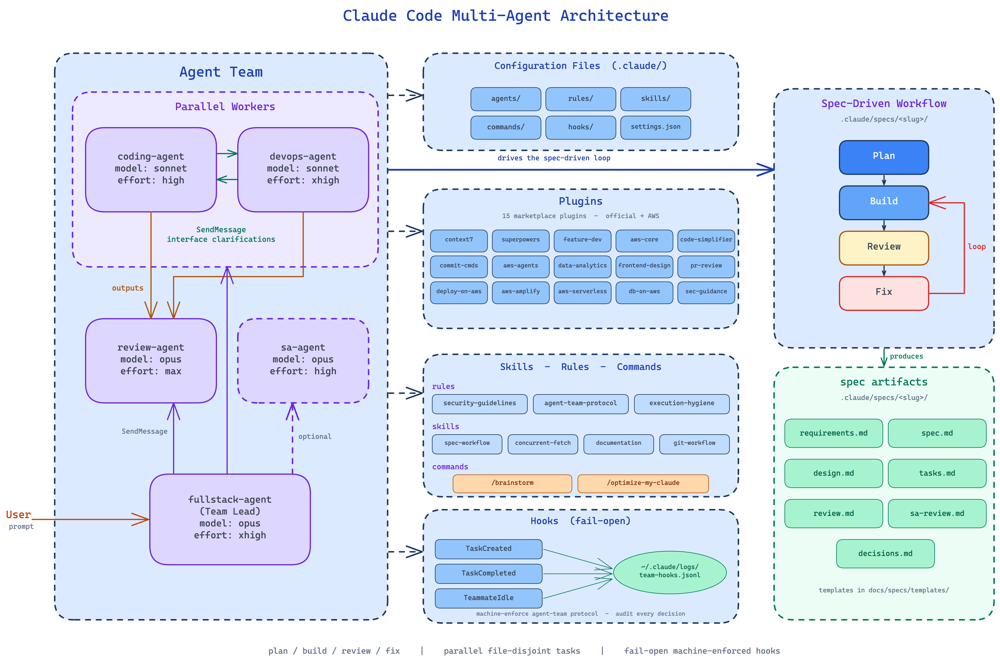

# Claude Code Multi-Agent Development Sample

A sample configuration for multi-agent development workflows using [Claude Code](https://docs.anthropic.com/en/docs/agents-and-tools/claude-code/overview). It shows how to set up a team of specialized AI agents that collaborate through a spec-driven process: a Full Stack lead orchestrates three specialists — Coding (application development), DevOps (infrastructure/deployment), and Review (code quality/security) — backed by Skills, Rules, and Plugins for the tooling and knowledge needed to ship a full-stack application to AWS.

> **Disclaimer**: This repository is provided as an example only and is **NOT approved for production use**. The agent configurations, rules, and workflows are starting points — not production-ready defaults. You should review, adjust, and tailor them to fit your own project requirements, team conventions, and security posture. Adoption of this sample requires organizational legal review — you must complete the [LLM Legal Approval](#llm-legal-approval) table before use.

## Overview



This repo provides a sample `.claude` configuration with four core agents that work together:

| Agent | Role | Model | Effort |
|-------|------|-------|--------|
| **fullstack-agent** | Team lead — researches, designs specs, creates plans, delegates work | opus | xhigh |
| **coding-agent** | Implements features and writes tests from specs | sonnet | high |
| **devops-agent** | Infrastructure, CI/CD, containers, and documentation | sonnet | xhigh |
| **review-agent** | Reviews implementations for correctness, security, and quality | opus | max |

Additional on-demand agents:

| Agent | Role | Model | Effort |
|-------|------|-------|--------|
| **sa-agent** | AWS Solutions Architect — Well-Architected reviews, cost/security | opus | high |

## How It Works

```
fullstack-agent (plan + research)
   → coding-agent ×N + devops-agent ×N (build in parallel, self-claiming from the Jira board)
   → review-agent ×N (analysts review slices in parallel; 1 synthesizer owns the verdict)
   → fullstack-agent (reads the synthesizer's single verdict → next sprint or fix)
```

The backlog lives in Jira, not in a file — see [Jira setup](#jira-setup-one-time) and [Watching a run](#watching-a-run).

1. **Plan** — `fullstack-agent` researches the problem and writes a spec (`spec.md`, `design.md`) under `.claude/specs/<slug>/`, decomposed into **wide, file-disjoint** parallel groups sized so a pool of same-role agents can each claim a unit of work at once
2. **Build** — `fullstack-agent` spawns parallel worker pools (up to **6 `coding`**, **2 `devops`**, **4 `review`**) as named background `Agent` teammates in the session's implicit team, opens a Jira sprint for the group, and creates every issue in it up front; instances self-claim unclaimed, unblocked issues (`status = "To Do"`) from the open sprint and drain it concurrently
3. **Review** — the `review-agent` pool reviews in parallel: analysts each review a disjoint slice and message findings to one **synthesizer**, who merges everything into a single PASS/FAIL verdict posted as a comment on the sprint's `role-review` issue (exactly one verdict per cycle; a lone reviewer handles small, cohesive groups)
4. **Fix** — if a sprint's review fails, `fullstack-agent` opens a fix sprint with new issues and loops back to build

Pool sizes are ceilings, not quotas — the lead sizes each pool to the parallel width of the issue graph (tiny jobs spawn 1 each). Agents coordinate through the Atlassian MCP (issue create/claim/transition/comment) and direct messaging (`SendMessage`); the lead spawns teammates as named background `Agent` instances in the session's implicit team, which is cleaned up automatically when the session ends.

## Prerequisites

- [Claude Code](https://docs.anthropic.com/en/docs/agents-and-tools/claude-code/overview) installed
- A Jira Cloud site and an Atlassian account — the agent team tracks all work there (see [Jira setup](#jira-setup-one-time))
- [Node.js](https://nodejs.org/) (for `npx`-based MCP servers)
- [uv](https://docs.astral.sh/uv/) (for `uvx`-based MCP servers)
- Python 3.8+ on `PATH` (the `.claude/hooks/` enforcement scripts use only the standard library)
- AWS credentials configured (for AWS MCP servers that need API access)
- *(Optional)* [tmux](https://github.com/tmux/tmux) or [iTerm2](https://iterm2.com/) with Python API enabled — for split-pane display where each agent gets its own visible pane. Without these, agent teams run in in-process mode (default), which works in any terminal.

## Jira setup (one time)

The agent team tracks all work in Jira. Two credentials, split by privilege:

**Runtime** — authenticate the Atlassian MCP:
```
/mcp
```
This grants `read:jira-work` and `write:jira-work`, which is everything the agents need. Because the grant is scoped that narrowly, it cannot create the project, add a workflow status, or run the sprint lifecycle — that needs a second, more privileged credential.

**Admin** — create a Jira API token at *id.atlassian.com > Security > API tokens*, then, **in a separate terminal from the one you launch Claude Code in**:
```bash
export JIRA_SITE=your-site.atlassian.net
export JIRA_EMAIL=you@example.com
export JIRA_API_TOKEN=...
```

The separate terminal is the point, not a formality. This token acts with your **full Jira permissions** — far beyond the MCP's `read/write:jira-work`. Every `Bash` command an agent runs is a child of the process you started Claude Code with and inherits its environment, so a token exported into that shell is readable by any agent in the session (`env`, `printenv`, any subprocess). Exporting it only in a separate shell means it is never in the agent session's environment at all, which is the one mechanism here that actually confines it.

Keeping the token out of agent hands otherwise rests on **instructions, not enforcement**: `fullstack-agent` is told never to pass it on, never to echo it, and to be the only actor that runs the bootstrap script. Nothing in the hooks or the harness checks that. If you do export it into the Claude Code shell (or run bootstrap through the lead), treat the token as exposed to the whole session and scope it accordingly.

The same applies mid-run: the sprint lifecycle (`sprint-open` / `sprint-close`) needs the admin token too. On the recommended path the lead messages you at each group boundary and **you** run the command in the separate terminal. Letting the lead run it instead is the convenience path, and it costs you the confinement — the token has to be in the session's environment for that to work.

`scripts/jira_bootstrap.py` is the only thing that uses it. `discover` writes the per-site field, status, and transition IDs to `.claude/jira-config.json` (gitignored) so nothing is hardcoded and the same repo works on any site — that config holds no credential, so the agents read it freely.

Run bootstrap **in that same separate terminal**, in this order — three steps, not two. The transition-discovery step samples *existing* issues' available transitions, so it is necessarily empty on a brand-new project. Step 2 happens in the Claude Code session; steps 1 and 3 are yours:

```bash
# 1. Create the project. On a fresh project this exits 4 (see below) -- expected, not
#    an error to work around: there are no issues yet for discover to probe.
python3 scripts/jira_bootstrap.py ensure-project --key AGENT --name "Agent Team"

# 2. Create the first issues (the spec's Epic and its first sprint's issues) so every
#    workflow status is occupied by at least one real issue.

# 3. Now discover can sample a representative issue per status and complete the map.
python3 scripts/jira_bootstrap.py discover --key AGENT
```

Both `ensure-project` and `discover` share three hard-precondition exit codes — know which one you hit:

- **exit 3** — the board has no `To Do` status. `To Do` is required, not discovered: "unclaimed" is encoded as that status because JQL cannot wildcard labels. Rename or add a `To Do` column on the board, then re-run.
- **exit 4** — the transition map is incomplete: some gated status (`In Review` / `Done`) has no inbound transition id, which would make the verify gate resolve that transition to "unknown target" and fail open. Create or move issues to cover each gated status, then re-run `discover`.
- **exit 5** — *no* status is gated: the board has neither `In Review` nor `Done` (a `To Do / In Progress / Complete` board, for instance), so the verification gate would guard nothing at all while looking correctly installed. Rename or add a column so one of them exists, then re-run `discover`.

If `discover` reports no `In Review` status, that is a **warning, not a failure — exit 0.** Follow its printed instructions (one board column edit) and re-run `discover`. Until you add it, only `Done` is gated. In practice this warning is uncommon: verified live, a team-managed Scrum project usually ships with `To Do` / `In Progress` / `In Review` / `Done` already present, so the board-column step is often unnecessary. The guidance above remains the correct remedy on a board that genuinely lacks `In Review`.

## Watching a run

Open the project board. Swimlanes group by the `agent-*` label, so each agent has its own lane showing exactly what it is working on. The active sprint is the current parallel group; the backlog holds the groups still to come. A flagged card is blocked, and the comment on it says why.

Useful filters:
- `project = AGENT AND status = "To Do"` — unclaimed work
- `project = AGENT AND labels = agent-coding-2` — one agent's history
- `project = AGENT AND status = "In Review"` — waiting on the reviewer

## Quick Start

1. Install [Claude Code](https://docs.anthropic.com/en/docs/agents-and-tools/claude-code/overview)

2. Get the configuration in place.

   This repo ships its own working `.claude/` directory (`agents/`, `rules/`, `skills/`, `hooks/`, `settings.json`) committed to git. **The fastest way to try it out is to run it in place**: clone the repo and start Claude Code from its root (`cd sample-claude-code-agent-team && claude`) — project-local config loads automatically, nothing to copy. Skip to step 3. Use Options A/B/C below only if you want this configuration available in another project, or globally.

> **Warning**: If you already have a `~/.claude/` directory with your own configuration, the commands below will overwrite files with matching names. Back up first and consider merging manually (Option B).

**Option A — Install globally** (use it in every project, not just this repo):

```bash
mkdir -p ~/.claude
cp -r .claude/agents .claude/rules .claude/skills .claude/hooks ~/.claude/
chmod +x ~/.claude/hooks/*.py
cp .claude/settings.json ~/.claude/settings.json

# This repo's settings.json wires hooks via $CLAUDE_PROJECT_DIR/.claude/hooks/. Once
# flattened into ~/.claude/hooks/ above, rewrite the hook commands in your copied
# settings.json to $HOME/.claude/hooks/... (drop the .claude/ segment) — see
# "Hook path resolution" below.
```

**Option B — Merge into an existing global config**:

```bash
# Back up your current config
cp -r ~/.claude ~/.claude.bak

# Copy agents, rules, skills, hooks (-n won't overwrite existing files)
cp -rn .claude/agents .claude/rules .claude/skills .claude/hooks ~/.claude/
chmod +x ~/.claude/hooks/*.py

# Then manually merge into your existing files:
# - settings.json: merge the "env", "enabledPlugins", and "hooks" keys (rewrite
#   hook paths from $CLAUDE_PROJECT_DIR/.claude/hooks/ to $HOME/.claude/hooks/ — see below)
```

**Hook path resolution.** This repo's `.claude/settings.json` wires the four Jira enforcement hooks with `python3 "$CLAUDE_PROJECT_DIR/.claude/hooks/..."`, which is correct as shipped (running in place, `$CLAUDE_PROJECT_DIR` is this repo). Once you flatten the hooks into `~/.claude/hooks/` for a global install (Option A/B), edit the `hooks` block in your copied/merged `settings.json` to drop the `.claude/` segment and point at `$HOME/.claude/hooks/...` instead. Either form works — the hooks themselves resolve `~/.claude/logs/...` paths via `$HOME` regardless of where the scripts live.

**Option C — Per-project install** (use it in a different project instead of this one or your global config):

Install into another project's `.claude/` directory — useful to try the setup on one repo, run different agent configs per project, or version the config alongside that project's code. Set `SAMPLE_REPO` to where you cloned this repo, then run from the *other* project's root:

```bash
SAMPLE_REPO=/path/to/sample-claude-code-agent-team

mkdir -p .claude
cp -r "$SAMPLE_REPO"/.claude/agents "$SAMPLE_REPO"/.claude/rules "$SAMPLE_REPO"/.claude/skills \
      "$SAMPLE_REPO"/.claude/hooks "$SAMPLE_REPO"/commands .claude/
chmod +x .claude/hooks/*.py
cp "$SAMPLE_REPO"/.claude/settings.json .claude/settings.json
```

No hook-path edits are needed here: the copied `settings.json` already resolves hooks via `$CLAUDE_PROJECT_DIR/.claude/hooks/`, and Claude Code points `$CLAUDE_PROJECT_DIR` at whichever project root you launch it from — the other project's, in this case. Project settings layer on top of your global config and take precedence for that project (see [Project-Local Settings](#project-local-settings-optional) for the full precedence order). Commit `.claude/` in that project to share the setup with your team, or `.gitignore` it to keep it personal.

3. Enable the agent teams experimental feature. Running in place, or using Option A/C, already covers this (the `settings.json` you copied carries it); if you merged manually (Option B), ensure your `settings.json` carries:

```json
{
  "env": {
    "CLAUDE_CODE_EXPERIMENTAL_AGENT_TEAMS": "1"
  }
}
```

4. Install required plugins.

   Plugins live in two marketplaces, both declared by this repo's `.claude/settings.json` via `enabledPlugins` (15 enabled) and `extraKnownMarketplaces`. The AWS marketplace registers automatically on next session start, but the **official Claude marketplace** must be registered explicitly — `extraKnownMarketplaces` only carries non-default sources.

   **a) Register the official Claude marketplace** (one-time, host-wide):

   ```bash
   claude plugin marketplace add anthropics/claude-plugins-official
   ```

   Then verify both are listed (`claude-plugins-official`, `agent-plugins-for-aws`):

   ```bash
   claude plugin marketplace list
   ```

   **b) Install + enable plugins.** With `settings.json` in place (project-local or copied to `~/.claude/`), restart Claude Code (`claude`). On session start, it reads `enabledPlugins`, fetches each plugin from its declared marketplace, installs it under `~/.claude/plugins/cache/`, and enables it — the first start can take ~30s while plugins download. Alternatively, browse and toggle plugins interactively with `claude /plugins`, or install one directly: `claude plugin install deploy-on-aws@agent-plugins-for-aws`.

   **c) Verify.** From inside Claude Code, run `/plugins` and confirm the 15 enabled plugins listed above show as **enabled**:

   | Marketplace | Plugins |
   |-------------|---------|
   | `claude-plugins-official` | `context7`, `superpowers`, `code-simplifier`, `commit-commands`, `feature-dev`, `frontend-design`, `pr-review-toolkit`, `security-guidance`, `aws-core`, `aws-agents`, `aws-data-analytics` |
   | `agent-plugins-for-aws` | `deploy-on-aws`, `aws-amplify`, `aws-serverless`, `databases-on-aws` |

   **Option B (merging into existing config):** make sure your merged `settings.json` includes **both** the full `enabledPlugins` block and the `extraKnownMarketplaces.agent-plugins-for-aws` block — without the marketplace definition, Claude Code cannot resolve the four AWS plugins (`@agent-plugins-for-aws`-suffixed names) even after the official marketplace is registered. Reference snippet:

   ```json
   {
     "enabledPlugins": {
       "deploy-on-aws@agent-plugins-for-aws": true,
       "aws-amplify@agent-plugins-for-aws": true,
       "aws-serverless@agent-plugins-for-aws": true,
       "databases-on-aws@agent-plugins-for-aws": true
     },
     "extraKnownMarketplaces": {
       "agent-plugins-for-aws": {
         "source": {
           "source": "github",
           "repo": "awslabs/agent-plugins"
         }
       }
     }
   }
   ```

   **Troubleshooting**:
   - *`marketplace add` fails with a clone error*: the repos are public, but `git` must be installed and reachable (configure your proxy first if behind one).
   - *Plugins in `enabledPlugins` show as missing in `/plugins`*: their marketplace isn't registered. Re-run `claude plugin marketplace list`; add `anthropics/claude-plugins-official` if absent (the AWS marketplace re-registers automatically from `settings.json`).
   - *Plugin loaded but its skills/agents are absent*: restart your session — plugin contributions are wired at session start, not hot-reloaded.

5. Start Claude Code with `claude`.

## Repository Structure

```
├── .claude/                     # Project-local Claude Code config — committed, loads automatically
│   ├── agents/                  # Agent definitions (markdown prompts with frontmatter)
│   │   ├── fullstack-agent.md   # Team lead — architecture, planning, coordination
│   │   ├── coding-agent.md      # Implements features and tests
│   │   ├── devops-agent.md      # Infrastructure, CI/CD, containers, docs
│   │   ├── review-agent.md      # Code review and quality verification
│   │   └── sa-agent.md          # AWS Solutions Architect — Well-Architected reviews
│   ├── rules/                   # Global behavioral rules for all agents (auto-loaded every session)
│   │   ├── AWS-security-guidelines.md # AWS security best practices and production safeguards
│   │   ├── agent-team-protocol.md     # Shared teammate lifecycle and communication protocol
│   │   └── execution-hygiene.md       # Non-interactive execution and dependency isolation
│   ├── skills/                  # Domain-specific knowledge files (invoked on demand)
│   │   ├── spec-workflow/           # Spec-driven development loop with parallel sprints
│   │   ├── jira-workflow/           # Claim protocol, issue shape, comment templates, sentinel
│   │   ├── concurrent-cached-fetch/ # Concurrent + disk-cached bulk external fetching
│   │   ├── documentation/           # Technical writing patterns
│   │   └── git-workflow/            # Git operations and conventions
│   ├── hooks/                   # Python hook scripts that machine-enforce the agent-team protocol
│   │   ├── team_hook_common.py             # Shared payload-parsing, audit-log, exit-contract helpers
│   │   ├── jira_mirror.py                  # Config loading + local mirror journal (shared by all 4 hooks)
│   │   ├── jira_issue_format_check.py      # PreToolUse createJiraIssue — enforce the issue shape
│   │   ├── jira_transition_verify_gate.py  # PreToolUse transitionJiraIssue — sentinel gate on In Review/Done
│   │   ├── jira_mirror_journal.py          # PostToolUse (create/edit/transition/comment) — records to the mirror
│   │   └── teammate_idle_workcheck.py      # TeammateIdle — nudge if claimable issues remain for the role
│   ├── settings.json            # Claude Code settings (env vars, enabled plugins, hook wiring)
│   └── jira-config.json         # Generated by `scripts/jira_bootstrap.py discover` — gitignored, per-site IDs
├── scripts/
│   └── jira_bootstrap.py        # Admin plane: project creation, ID discovery, sprint lifecycle (needs a Jira API token)
├── commands/                    # Optional slash commands (see Optional Commands section)
│   ├── brainstorm.md            # `/brainstorm` — structured new-project ideation -> requirements.md
│   └── optimize-my-claude.md    # `/optimize-my-claude` — audit and tune ~/.claude after model releases
├── docs/
│   ├── design.md                 # This sample's own architecture notes
│   └── specs/templates/          # spec.md / design.md / sa-review.md / decisions.md / prd.md starting points
├── tests/                        # pytest suite: hooks, the bootstrap script, and cross-doc consistency (`.venv/bin/pytest`)
├── requirements-dev.txt          # Pinned dev dependencies (pytest and friends)
├── pytest.ini                    # Test discovery config
└── .gitignore                    # .venv/, __pycache__/, and the per-site .claude/jira-config.json
```

## Key Concepts

**Agents** define who does what. Each is a markdown file with YAML frontmatter (name, description, model, optional `effort`) and a system prompt (role, constraints, workflow). The team lead (`fullstack-agent`) spawns and coordinates teammates. The optional `effort` field tunes reasoning depth.

**Rules** are global behavioral constraints applied to all agents — like AWS security guidelines and production safeguards honored on every interaction (see [Rules](#rules)).

**Skills** are domain-specific knowledge agents invoke on demand — patterns and protocols for workflows such as spec-driven development and git workflow (see [Skills](#skills)).

**Hooks** are Python scripts wired into `.claude/settings.json` that machine-enforce the protocol across four events on the Atlassian MCP's Jira tools, fail-open, auditing every decision to `~/.claude/logs/team-hooks.jsonl` (see [Hooks](#hooks)).

**Specs** are created at runtime in `.claude/specs/<slug>/` and hold the design decisions and decision logs for each piece of work — the backlog itself (issues, sprints, review verdicts) lives in Jira, not on disk. Reusable templates (`spec.md`, `design.md`, `sa-review.md`, `decisions.md`, `prd.md`) live in `docs/specs/templates/` — agents copy them into a new spec as starting points.

## Rules

| Rule | Purpose |
|------|---------|
| `AWS-security-guidelines.md` | Enforces AWS security best practices including least-privilege access, production safeguards, and credential handling |
| `agent-team-protocol.md` | Shared teammate lifecycle — claiming Jira issues, communication patterns, verification gates (machine-enforced via `.claude/hooks/`; see [Hooks](#hooks)), and blocker reporting. Loaded as a rule (not a skill) so every spawned teammate inherits it without invoking `Skill` |
| `execution-hygiene.md` | Non-interactive execution (`-y`/`--yes`/`--no-input`, disabled pagers, no TTY assumptions) and per-language dependency isolation (venvs, `node_modules`, cargo, go mod) with version pinning and lock files. Loaded as a rule so every session — team or solo — inherits it |

## Skills

| Skill | Purpose |
|-------|---------|
| `spec-workflow` | Defines the full plan → build → review loop with parallel sprints and the `.claude/specs/<slug>/` directory structure; the backlog itself lives in Jira. Structural conventions are also inlined into each agent file so they are always visible; this skill carries the deeper workflow narrative on demand |
| `jira-workflow` | Claim protocol, issue shape, comment templates, and the verification sentinel for working Jira issues as a teammate. Loaded before any agent claims or authors an issue |
| `concurrent-cached-fetch` | Patterns for code that fans out over many independent external calls — bounded concurrency plus a content-keyed, no-expiry disk cache, with ready-to-adapt implementations in Python, JS/TS, Go, and Java. `fullstack-agent` plans for it, `coding-agent` loads it before any bulk-fetch loop, and `review-agent` flags sequential/uncached bulk I/O |
| `documentation` | Technical writing patterns for runbooks, architecture docs, and AWS service doc linking. Invoked by `coding-agent`/`devops-agent` at task close-out, and by `fullstack-agent` to refresh docs before cleanup |
| `git-workflow` | Conventional commit style, branch naming, and integration with the `commit-commands` plugin for commit/push/PR flows |

## Hooks

Four Python scripts in `.claude/hooks/` machine-enforce the agent-team protocol against the Atlassian MCP's Jira tools. They are wired in `.claude/settings.json` and resolved at runtime via `$CLAUDE_PROJECT_DIR/.claude/hooks/...` (this repo) or `$HOME/.claude/hooks/...` (when installed globally — see "Hook path resolution" in [Quick Start](#quick-start)). Every decision is audited to `~/.claude/logs/team-hooks.jsonl`, and all hooks are **fail-open**: any unexpected condition — including no `.claude/jira-config.json` yet — allows the action, so a hook bug (or a not-yet-bootstrapped project) can never block a teammate.

| Event | Matcher | Script | Enforcement |
|-------|---------|--------|-------------|
| `PreToolUse` | `createJiraIssue` | `jira_issue_format_check.py` | Blocks creation unless the summary carries a `[role]` tag, the description has `Spec:`/`Files:`/`Acceptance:`/`Run:`, and `role-*` + `spec-*` labels are present and agree with the summary tag |
| `PreToolUse` | `transitionJiraIssue` | `jira_transition_verify_gate.py` | Blocks a transition into a gated status (`In Review` / `Done`) unless a verification sentinel exists for that issue |
| `PostToolUse` | `createJiraIssue`\|`editJiraIssue`\|`transitionJiraIssue`\|`addCommentToJiraIssue` | `jira_mirror_journal.py` | Never blocks — records every successful mutation to `~/.claude/logs/jira-mirror/<projectKey>.jsonl`, the local mirror the other hooks read (a hook subprocess holds no Jira OAuth token) |
| `TeammateIdle` | — | `teammate_idle_workcheck.py` | Nudges a teammate that is going idle while unclaimed, unblocked issues (`status = "To Do"`) tagged with its role still exist in the mirror (capped at 2 nudges per claimable set, loop-safe) |

### Issue shape

Every Task issue authored in the agent project must carry:

```
Summary:     [coding|devops|sa|review] <verb> <what>
Labels:      spec-<slug>, role-<role>
Description:
  Spec:       .claude/specs/<slug>/spec.md#<section>
  Files:      comma-separated paths this issue may write
  Acceptance: what must be true when it is done
  Run:        the verification command
```

Example summary: `[coding] add JWT verifier`, with `Files: src/auth/jwt.ts`, `Run: npm test -- src/auth` in the description.

### Verification sentinel

Before a teammate transitions an issue to `In Review` or `Done`, it must run the issue's `Run:` command and then write a sentinel attesting that it passed:

```bash
mkdir -p ~/.claude/logs/verified/<projectKey>
echo "<the Run command> PASSED" > ~/.claude/logs/verified/<projectKey>/<ISSUE-KEY>.verified
```

The hook deletes the sentinel on a successful transition so it cannot be reused. The hook can't read the teammate's transcript — the sentinel is the teammate's attestation that verification actually happened. **This is not identity-checked**: the gate only verifies a sentinel exists, never who wrote it or what the prior status was, so an implementer that writes a second sentinel could technically self-close its own issue. "Only the review synthesizer transitions to `Done`" is therefore a protocol convention the team follows, not a machine-enforced guarantee — see the `jira-workflow` skill's "Closing" section.

### Bypass labels

Add either label to an issue for legitimate exceptions:

| Label | Use when |
|-------|----------|
| `skip-format-check` | The issue is coordination/research/non-build work and doesn't need the full `Spec:`/`Files:`/`Acceptance:`/`Run:` shape. Epics are exempt automatically |
| `skip-verify` | The issue is pure analysis or documentation with no runnable verification command (typical for some `[sa]` / docs-only issues). Prefer a real `Run:` (lint, validate, `--dry-run`, query check) over a skip label where one exists |

### Verifying hooks are wired

These hooks fail open with no configured project, so a smoke test needs a fixture `.claude/jira-config.json` (via `JIRA_CONFIG_PATH`) rather than the real one. From the repo root:

```bash
TMPCFG=$(mktemp)
echo '{"projectKey": "AGENT", "gatedStatuses": ["Done"], "transitions": {"31": "Done"}}' > "$TMPCFG"

# Should exit 2 (block) — summary has no [role] tag
echo '{"tool_name":"mcp__plugin_atlassian_atlassian__createJiraIssue","tool_input":{"projectKey":"AGENT","summary":"add a thing","description":"Spec: x Files: x Acceptance: x Run: x","additional_fields":{"labels":["role-coding","spec-demo"]}}}' \
  | JIRA_CONFIG_PATH="$TMPCFG" python3 .claude/hooks/jira_issue_format_check.py

# Should exit 0 (allow) — well-formed
echo '{"tool_name":"mcp__plugin_atlassian_atlassian__createJiraIssue","tool_input":{"projectKey":"AGENT","summary":"[coding] add a thing","description":"Spec: x Files: x Acceptance: x Run: x","additional_fields":{"labels":["role-coding","spec-demo"]}}}' \
  | JIRA_CONFIG_PATH="$TMPCFG" python3 .claude/hooks/jira_issue_format_check.py

# Should exit 2 (block) — no verification sentinel for AGENT-1
echo '{"tool_name":"mcp__plugin_atlassian_atlassian__transitionJiraIssue","tool_input":{"issueIdOrKey":"AGENT-1","transition":{"id":"31"}}}' \
  | JIRA_CONFIG_PATH="$TMPCFG" python3 .claude/hooks/jira_transition_verify_gate.py

# Should exit 0 (fail-open) — unparseable payload
echo '{}' | JIRA_CONFIG_PATH="$TMPCFG" python3 .claude/hooks/jira_transition_verify_gate.py

rm -f "$TMPCFG"
```

The mirror journaller (`jira_mirror_journal.py`) never blocks, and the idle nudge (`teammate_idle_workcheck.py`) depends on accumulated mirror state — both are exercised end-to-end by the automated suite rather than a one-off payload: `.venv/bin/pytest tests/hooks/ -v`.

If `claude /doctor` reports the hook commands and Claude Code logs each `PreToolUse` / `PostToolUse` / `TeammateIdle` decision to `~/.claude/logs/team-hooks.jsonl`, enforcement is live.

The full convention, including loop-guard semantics for `TeammateIdle` and the audit-log schema, lives in `.claude/rules/agent-team-protocol.md` → "Enforced Hooks".

## Optional Commands

The `commands/` directory holds optional slash commands that plug into this workflow. They aren't required for the core plan → build → review loop, but cover two common needs around it: starting new work and keeping the configuration current. They need to live under a `.claude/commands/` directory to be picked up — install them alongside the other config, then invoke from any session:

```bash
cp -r commands/ ~/.claude/commands/
```

| Command | When to Use | Purpose |
|---------|-------------|---------|
| `/brainstorm` | Starting a new project from a rough idea | Walks through up to 10 clarifying questions (users, scale, integrations, NFRs, budget, deployment, edge cases, MVP scope) and writes `.claude/specs/<slug>/requirements.md` — the starting point the `spec-workflow` skill turns into `spec.md` and `design.md` (the backlog itself is authored directly into Jira, not into a file) |
| `/optimize-my-claude` | Following a new Claude model release | Audits the full `~/.claude` configuration against current best practices for the active model — flagging deprecated env vars, stale model IDs, cost leaks, redundant content, and missing features. Presents findings by impact, waits for approval, then applies only the approved changes. Pass an optional focus area (e.g., `/optimize-my-claude settings`) to scope it |

Both commands are interactive — they ask for confirmation before writing files or making configuration changes.

## Plugins

This configuration enables the following Claude Code plugins via `.claude/settings.json`:

| Plugin | Purpose |
|--------|---------|
| context7 | Live documentation lookup for libraries and frameworks |
| superpowers | Enhanced development workflows (TDD, debugging, planning) |
| feature-dev | Guided feature development with architecture focus |
| pr-review-toolkit | Comprehensive PR review with specialized agents |
| commit-commands | Git commit, push, and PR creation (GitHub via the `gh` CLI) |
| code-simplifier | Code clarity and maintainability refinement. Ships a **subagent**, not a skill — dispatch it with the `Agent` tool (`code-simplifier:code-simplifier`) |
| frontend-design | Production-grade frontend interface design |
| security-guidance | Security best practices — container hardening, secrets handling, and least-privilege guidance |
| deploy-on-aws | AWS deployment — codebase analysis, service recommendation, cost estimation, IaC generation. Provides `awsiac` (CloudFormation/CDK validation), `awspricing` (cost reports), and an architecture-diagram skill |
| aws-amplify | AWS Amplify Gen 2 — full-stack app deployment, auth, data models, storage, GraphQL APIs, sandbox/production environments |
| aws-serverless | AWS serverless — Lambda design/build/deploy/test, SAM CLI, API Gateway (REST/HTTP/WebSocket), Event Source Mapping, durable functions |
| databases-on-aws | Aurora DSQL — queries, schema inspection, migrations, and best-practice recommendations |
| aws-core | Core AWS services — CDK/CloudFormation IaC, ECS/Fargate/ECR, IAM, CloudWatch/X-Ray observability, SQS/SNS/EventBridge/Kinesis, Amazon Bedrock, AWS SDK usage, Secrets Manager, cost/billing. Provides the `aws-mcp` proxy (`call_aws`, `run_script`, AWS docs) |
| aws-agents | AI agents on AWS — scaffold, build, connect, deploy, harden, and optimize Amazon Bedrock AgentCore agents |
| aws-data-analytics | Data lake & analytics — S3 Tables/Iceberg, Glue/Athena, ingestion, and vector storage. Seven skills: `connecting-to-data-source`, `creating-data-lake-table`, `exploring-data-catalog`, `finding-data-lake-assets`, `ingesting-into-data-lake`, `querying-data-lake`, `storing-and-querying-vectors` |

## Speed & Orchestration Modes

Two on-demand Claude Code modes pair well with this agent-team setup. Both are optional and used per-task — not configured in this repo.

- **`/fast`** — toggles faster Opus output without switching to a smaller model (available on Opus 5/4.8/4.7). Useful for interactive work (live debugging, tight edit-test loops) where latency matters more than token economy. Toggle it at session start rather than mid-conversation. It doesn't change an agent's model — that stays in each agent's `model` frontmatter. **First-party Anthropic API only:** the CLI gates fast mode on backend identity, not model, so on an Amazon Bedrock, Google Vertex, or Microsoft Foundry route it refuses with *"Fast mode is only available when using the Anthropic API directly"* — the underlying beta (`speed: "fast"`) is not offered on those platforms, and no model choice works around it.
- **Workflows / `ultracode`** — multi-agent orchestration that fans a task out across many subagents (parallel audits, large migrations, broad multi-file sweeps, adversarial review). Opt in by including the word **workflow** in a request, monitor progress with `/workflows`, or turn on **ultracode** for a standing workflow-per-task default. A heavier, broader-coverage complement to the lead → teammates → review loop; reach for it when a task genuinely needs the breadth, and stay with the standard team loop otherwise.

## Project-Local Settings (Optional)

`.claude/settings.local.json` is your **personal, per-project** settings file, conventionally kept out of version control (this repo's own copy is excluded via a global gitignore rather than the committed [`.gitignore`](.gitignore) — add an entry for it in yours if you want the exclusion tracked in-repo). It's the home for anything you don't want to share or hard-code into the shared config: a **permission allow-list** so Claude Code stops prompting for tools you trust, project MCP opt-ins, and machine- or account-specific `env`/`model` overrides.

Claude Code combines settings across scopes in this priority order:

1. **Managed** (enterprise/MDM) — highest, cannot be overridden
2. **Command-line flags** — temporary session overrides
3. **Local** — `.claude/settings.local.json` (personal, per-project)
4. **Project** — `.claude/settings.json` (shared, committed to git)
5. **User** — `~/.claude/settings.json` (your global defaults) — lowest

For single-valued keys (e.g. `model`), the higher scope wins, so a project's `.claude/settings.local.json` overrides your global settings for that project only. Permission allow-lists are **additive** — entries from every scope combine, so a project-local list extends your global one rather than replacing it.

**Create it** — most commonly to pre-approve the tools and commands you trust, the same `permissions` block you keep in your global `~/.claude/settings.local.json`:

```bash
mkdir -p .claude
cat > .claude/settings.local.json <<'JSON'
{
  "permissions": {
    "allow": [
      "Read",
      "Edit",
      "Grep",
      "Glob",
      "Bash(git status)",
      "Bash(npm test:*)",
      "WebFetch(domain:docs.aws.amazon.com)"
    ]
  }
}
JSON
```

Notes:
- **Scope to least privilege.** Each entry is a tool Claude Code may then run without asking. A bare name like `"Bash"` or `"Edit"` approves *every* use; prefer scoped forms — `"Bash(npm test:*)"`, `"WebFetch(domain:...)"` — for anything with side effects, and grant only what you're comfortable auto-approving.
- Same shape as the repo's own [`.claude/settings.local.json`](.claude/settings.local.json), which ships with an empty `allow` list.
- The file can also carry personal `env` or `model` overrides — e.g. `"model": "opus"`, or on Amazon Bedrock the inference-profile IDs (`"model": "us.anthropic.claude-opus-5"` plus `ANTHROPIC_DEFAULT_OPUS_MODEL` / `ANTHROPIC_DEFAULT_SONNET_MODEL` / `ANTHROPIC_DEFAULT_HAIKU_MODEL` entries in `env`). Note that `ANTHROPIC_DEFAULT_MODEL` — without a tier — is **not** a recognized variable and is silently ignored; the main-loop override is `ANTHROPIC_MODEL`. It need **not** restate `hooks`, `enabledPlugins`, or marketplaces from the shared config.

## Customization

- **Add agents**: Create a new `<name>.md` in `.claude/agents/` with frontmatter (`name`, `description`, `model`, optional `effort`), then reference it in the fullstack-agent's team composition
- **Add rules**: Drop a markdown file in `.claude/rules/` — all agents will follow it
- **Add skills**: Create a `<name>/SKILL.md` in `.claude/skills/` — agents reference these for domain knowledge
- **Change models**: Edit the `model` field in each agent's YAML frontmatter. Available models: `opus`, `sonnet`, `haiku`
- **Add MCP servers**: this repo ships no `.mcp.json` — Jira access comes from the Atlassian remote MCP via `/mcp` (see [Jira setup](#jira-setup-one-time)), and the AWS/dev-workflow MCP capability comes from the plugins in `enabledPlugins`. Add a `.mcp.json` at the repo root only if you need a custom server; entries there are auto-installed via `npx`/`uvx` on first use

## LLM Legal Approval

| Field | Value |
|-------|-------|
| Service | Claude (Anthropic) |
| Approval Status | [To be completed by adopter] |
| Approval Date | [Date] |
| Approval Authority | [Legal/Procurement team] |
| License Terms | [Link to agreement] |
| Usage Restrictions | [Any limitations] |

> **Note**: Adopters must complete this section with their organization's legal approval status before using Claude Code in any project. Consult your legal and procurement teams for guidance on AI/LLM usage policies.

## Dataset Compliance

No dataset is provided or required. This repository contains only configuration files (agent definitions, rules, skills, and MCP server configurations) — no training data, evaluation data, or other datasets are included.

## Security

See [SECURITY.md](SECURITY.md) for the full security overview including threat model, AI security controls, and risk assessment.

For security issue notifications, see [CONTRIBUTING](CONTRIBUTING.md#security-issue-notifications).

## License

This library is licensed under the MIT-0 License. See the [LICENSE](LICENSE) file.
